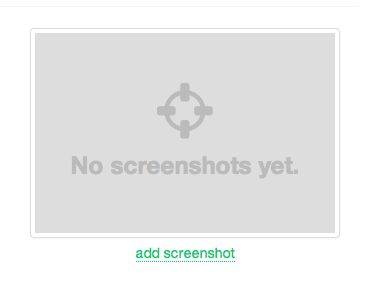

# Projeto: Remake de site/app web

Acesso: Substitua este texto pela URL para acesso ao site publicado

#### Desenvolvedor(a)
Vitória Luiza Camara (Sistemas de Informação)

#### Cliente
Amazon

#### Site/app original
Amazon

##### Link
https://www.amazon.com.br/

##### Descrição
O site original da Amazon é uma plataforma de comércio eletrônico que oferece uma ampla variedade de produtos, desde livros até eletrônicos e vestuário. O site tem um design funcional, mas pode apresentar desafios em termos de navegação devido à grande quantidade de informações exibidas simultaneamente. O código é estruturado para alta escalabilidade e desempenho, mas pode se beneficiar de uma interface mais minimalista e otimizada para acessibilidade.

#### Demanda do(a) cliente
O cliente busca um redesign do site, com foco em:

Melhor experiência do usuário;

Interface mais intuitiva e acessível;

Otimização para dispositivos móveis;

Melhor organização das categorias de produtos.

#### Desenvolvimento

O processo de desenvolvimento inclui:

Análise do site original: Estudo dos principais problemas de usabilidade e performance.

Definição do escopo: Identificação dos principais pontos de melhoria.

Implementação do código: Uso de tecnologias modernas para criar um site otimizado.

#### Tecnologias

Front-end: HTML5, CSS3, JavaScript

Hospedagem: GitHub Pages

#### Ambiente de desenvolvimento

Editor de Código: VS Code 

Controle de Versão: GitHub

#### Referências e créditos

Substitua este trecho por uma lista bem detalhada de todo material que você consultou para ajudar no projeto, por exemplo:  URL de templates usados, URL de icon kits usados, créditos para colegas que colaboraram, geradores de código (incluindo alguns prompts usados para o ChatGPT, se for o caso)
- Ícones: [https://www.flaticon.com/br/]

- Plataformas consultadas: [https://chat.openai.com/]

---
Projeto entregue para a disciplina de [Desenvolvimento de Software para a Web](http://github.com/andreainfufsm/elc1090-2025a) em 2025a
